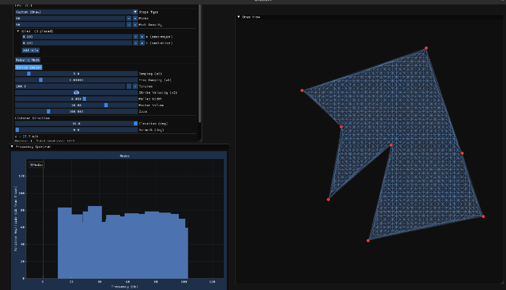

# Drums C++

Real-time interactive drum membrane simulator with GUI, built with SDL2, ImGui, and Eigen.



## Overview

This project simulates the sound of striking a 2D membrane of arbitrary shape in real-time. It uses:
1. **Constrained Delaunay Triangulation (CDT)** to mesh arbitrary shapes, including shapes with holes.
2. **Finite Element Method (FEM)** to assemble the stiffness and mass matrices.
3. **Spectra** to solve the generalized eigenvalue problem, extracting the natural frequencies and mode shapes.
4. **Exact Phasor Integration** to synthesize the drum sound accurately without numerical dispersion.

## System Dependencies

CMake prefers your system-installed SDL2. Please install SDL2 and its development headers via your package manager to ensure your audio backend (PipeWire/PulseAudio/ALSA) is supported.

### Ubuntu / Debian

```bash
# PipeWire / PulseAudio / ALSA depending on your system
sudo apt-get install -y cmake g++ libeigen3-dev libgl-dev libsdl2-dev
```
*(If you encounter "Failed to init audio", ensure you didn't accidentally build SDL2 from source without audio backend headers. Clear your `build/` dir after installing system dependencies).*

All other dependencies (ImGui, ImPlot, Spectra, CDT) are fetched automatically by CMake.

## Build & Run

```bash
mkdir -p build && cd build
cmake .. -DCMAKE_BUILD_TYPE=Release
cmake --build . -j$(nproc)
./drums_cpp
```

## Features & Controls

| Feature | Description |
|---|---|
| **Custom Shapes** | Draw custom polygons by clicking vertices. Right-click to close. |
| **Holes** | Select "Placing Hole" mode to punch elliptical holes out of the drum mesh. |
| **Draggable Points** | Click and drag the red vertices of polygons or ellipses to resize them in real-time. |
| **Material Physics** | Real-time tuning of Tension, Damping (frequency independent and proportional), and strike properties. |
| **Spectrogram** | Zero-based dB plot showing the real-time amplitude and decay of each physical mode. |

## Architecture

- **`geometry.h`** — Mesh generation (polygons, ellipses, isospectral drums, custom shapes with holes via CDT)
- **`fem.h`** — FEM stiffness (K) and mass (M) matrix assembly
- **`solver.h`** — Eigenvalue solver using Spectra (shift-invert mode)
- **`audio.h`** — Real-time audio engine with strict concurrency control and realistic decay physics
- **`main.cpp`** — SDL2/ImGui application loop, rendering, and interaction

## License

MIT
