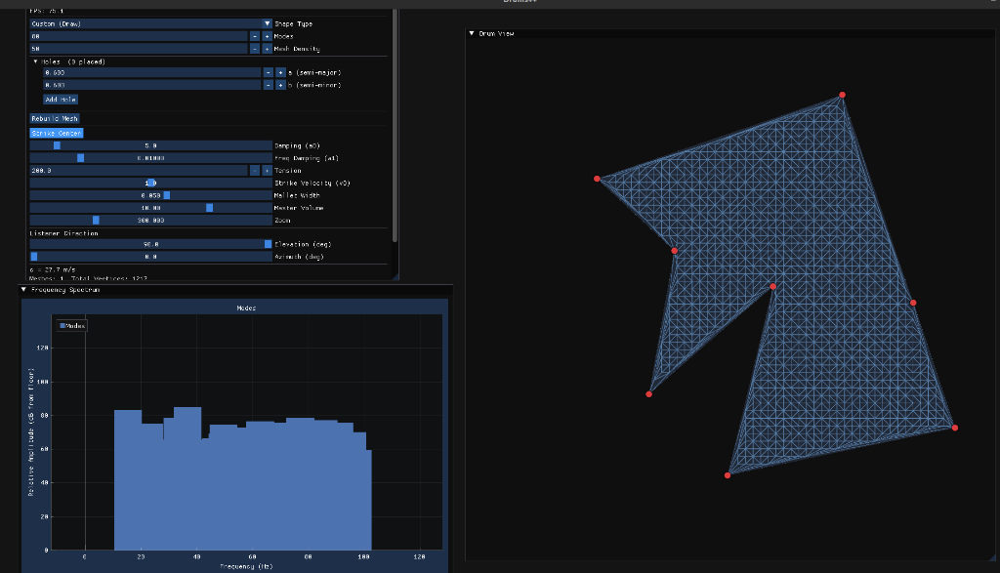

# Drums++

Real-time interactive drum membrane simulator with GUI



## Overview

Can you [hear the shape of a drum](https://en.wikipedia.org/wiki/Hearing_the_shape_of_a_drum)? Turns out the answer is [no](https://en.wikipedia.org/wiki/Hearing_the_shape_of_a_drum#The_answer). 
However, even though you can't uniquely determine a shape by the eigenvalues of the boundary value problem for the Laplacian, there's nothing to stop us from trying to play drums of odd construction.
The goal of this project is to answer a different question: how does that drum sound?


Unfortunately simulating the "real" physics of a drum is quite an intensive task, and falls within the family of techniques called [physical modeling synthesis](https://en.wikipedia.org/wiki/Physical_modelling_synthesis).
Our work falls squarely in the family of methods called ["modal synthesis"](https://ccrma.stanford.edu/~bilbao/booktop/node14.html). However, what we lack in realism we make up for with a real-time 
interactive GUI. 

Nevertheless, we include some ad-hoc corrections to the base modal synthesis structure to approximate "realism". These include:

1. **Linear and non-linear damping** Control the rate and power-law decay of frequncies as $a_0 + a_1\omega^\beta$
2. **Air and Edge loss** Control the rate of decay of modes propagating through the air or close to the edges of drum boundary
3. **Striker physics** Control the mass, stiffness, width, and hardness of a drumstick striking the drum
4. **Pitch glide** Approximate non-linear effects in the membrane tensioning 
5. **Pickup controls** Control the location of a listener, the contributions of the displacement, velocity, and acceleration of the pressure wave to the pickup sound
6. **More improvements to come**

So, if you ever wondered to yourself: "what a drum shaped like *that* would sound like?"
if you tune the parameters just right, you might be able to get like an 80% fidelity answer to that question. 

## System Dependencies

CMake prefers your system-installed SDL2. Please install SDL2 and its development headers via your package manager to ensure your audio backend (PipeWire/PulseAudio/ALSA) is supported.

### Ubuntu / Debian

```bash
# PipeWire / PulseAudio / ALSA depending on your system
sudo apt-get install -y cmake g++ libeigen3-dev libgl-dev libsdl2-dev
```
*(If you encounter "Failed to init audio", ensure you didn't accidentally build SDL2 from source without audio backend headers. Clear your `build/` dir after installing system dependencies).*

All other dependencies (ImGui, ImPlot, Spectra, Triangle) are fetched automatically by CMake.

## Build & Run

```bash
mkdir -p build && cd build
cmake .. -DCMAKE_BUILD_TYPE=Release
cmake --build . -j$(nproc)
./drums_cpp
```

## Features & Controls

| Feature | Description |
|---|---|
| **Custom Shapes** | Draw custom polygons by clicking vertices. Right-click to close. |
| **Holes** | Select "Placing Hole" mode to punch elliptical holes out of the drum mesh. |
| **Draggable Points** | Click and drag the red vertices of polygons or ellipses to resize them in real-time. |
| **Material Physics** | Real-time tuning of Tension, Damping (frequency independent and proportional), and strike properties. |
| **Spectrogram** | Zero-based dB plot showing the real-time amplitude and decay of each physical mode. |

## Architecture

- **`geometry.h`** — Mesh generation (polygons, ellipses, isospectral drums, custom shapes with holes via Triangle with quality refinement)
- **`fem.h`** — FEM stiffness (K) and mass (M) matrix assembly
- **`solver.h`** — Eigenvalue solver using Spectra (shift-invert mode)
- **`audio.h`** — Real-time audio engine with strict concurrency control and realistic decay physics
- **`main.cpp`** — SDL2/ImGui application loop, rendering, and interaction

## License

MIT
